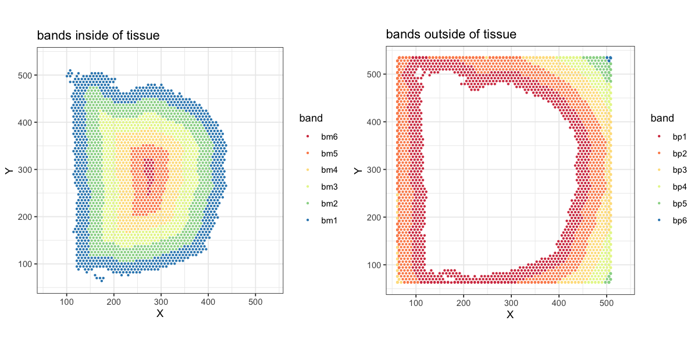
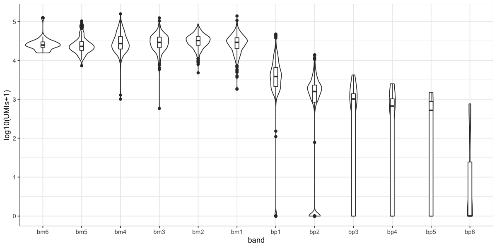

```R
suppressMessages(library('data.table'))
suppressMessages(library('tidyverse'))
suppressMessages(library('cowplot'))
suppressMessages(library('VisualVisium'))
```


```R
# Load the count matrix and the tissue positions list into R objects.
# A compressed version of V1_Adult_Mouse_Brain_outs is stored at inst/extdata.
cntmtr_tpl <- rawmatr_and_tpl("/Volumes/Backup\ Plus/10x_datasets/V1_Adult_Mouse_Brain_outs")
```


```R
# The tissue positions list table; each row corresponds to a spot in the array.
# See detailed description at https://support.10xgenomics.com/spatial-gene-expression/software/pipelines/latest/output/images
tpl <- cntmtr_tpl[['tpl']]
head(tpl)
```


<table>
<caption>A data.table: 6 × 7</caption>
<thead>
	<tr><th scope=col>barcode</th><th scope=col>tissue</th><th scope=col>row</th><th scope=col>col</th><th scope=col>imagerow</th><th scope=col>imagecol</th><th scope=col>umis</th></tr>
	<tr><th scope=col>&lt;chr&gt;</th><th scope=col>&lt;int&gt;</th><th scope=col>&lt;int&gt;</th><th scope=col>&lt;int&gt;</th><th scope=col>&lt;dbl&gt;</th><th scope=col>&lt;dbl&gt;</th><th scope=col>&lt;dbl&gt;</th></tr>
</thead>
<tbody>
	<tr><td>ACGCCTGACACGCGCT-1</td><td>0</td><td>0</td><td>0</td><td>63.84282</td><td>61.75045</td><td>1112</td></tr>
	<tr><td>TACCGATCCAACACTT-1</td><td>0</td><td>1</td><td>1</td><td>69.96683</td><td>65.27175</td><td>1565</td></tr>
	<tr><td>ATTAAAGCGGACGAGC-1</td><td>0</td><td>0</td><td>2</td><td>63.84282</td><td>68.79306</td><td>1521</td></tr>
	<tr><td>GATAAGGGACGATTAG-1</td><td>0</td><td>1</td><td>3</td><td>69.96683</td><td>72.31436</td><td>2218</td></tr>
	<tr><td>GTGCAAATCACCAATA-1</td><td>0</td><td>0</td><td>4</td><td>63.84282</td><td>75.83567</td><td>2302</td></tr>
	<tr><td>TGTTGGCTGGCGGAAG-1</td><td>0</td><td>1</td><td>5</td><td>69.96683</td><td>79.30594</td><td>2945</td></tr>
</tbody>
</table>


```R
# The raw count matrix, with genes in the rows, spots in the columns (includes all the spots in the array).
# See detailed description at https://support.10xgenomics.com/spatial-gene-expression/software/pipelines/latest/output/matrices
count_matrix <- cntmtr_tpl[['raw_matrix']]
str(count_matrix)
```

     num [1:32285, 1:4992] 0 0 0 0 0 0 0 0 0 0 ...
     - attr(*, "dimnames")=List of 2
      ..$ : chr [1:32285] "ENSMUSG00000051951" "ENSMUSG00000089699" "ENSMUSG00000102331" "ENSMUSG00000102343" ...
      ..$ : chr [1:4992] "AAACAACGAATAGTTC-1" "AAACAAGTATCTCCCA-1" "AAACAATCTACTAGCA-1" "AAACACCAATAACTGC-1" ...


```R
# Function that groups spots into bands around the perimeter of the tissue.
tpl_wbands <- visium_bands(tpl)
head(tpl_wbands)
```


<table>
<caption>A data.table: 6 × 8</caption>
<thead>
	<tr><th scope=col>barcode</th><th scope=col>tissue</th><th scope=col>row</th><th scope=col>col</th><th scope=col>imagerow</th><th scope=col>imagecol</th><th scope=col>umis</th><th scope=col>band</th></tr>
	<tr><th scope=col>&lt;chr&gt;</th><th scope=col>&lt;dbl&gt;</th><th scope=col>&lt;dbl&gt;</th><th scope=col>&lt;dbl&gt;</th><th scope=col>&lt;dbl&gt;</th><th scope=col>&lt;dbl&gt;</th><th scope=col>&lt;dbl&gt;</th><th scope=col>&lt;ord&gt;</th></tr>
</thead>
<tbody>
	<tr><td>CACATAAGGCGACCGT-1</td><td>1</td><td>1</td><td>29</td><td>69.96683</td><td>163.6132</td><td>32871</td><td>bm1</td></tr>
	<tr><td>ATACGCCGATCTACCG-1</td><td>1</td><td>1</td><td>31</td><td>69.96683</td><td>170.6047</td><td>34445</td><td>bm1</td></tr>
	<tr><td>ACTTATCTGATCTATA-1</td><td>1</td><td>0</td><td>32</td><td>63.84282</td><td>174.1260</td><td>24496</td><td>bm1</td></tr>
	<tr><td>GTGTGAGCCGAGGTGC-1</td><td>1</td><td>1</td><td>33</td><td>69.96683</td><td>177.6474</td><td>34103</td><td>bm1</td></tr>
	<tr><td>TCTGTGACTGACCGTT-1</td><td>1</td><td>3</td><td>23</td><td>82.21485</td><td>142.5364</td><td>20585</td><td>bm1</td></tr>
	<tr><td>CTAGCAACTAATTTAC-1</td><td>1</td><td>2</td><td>28</td><td>76.09084</td><td>160.0919</td><td>26016</td><td>bm1</td></tr>
</tbody>
</table>


```R
# Plot the inside-tissue and outside-tissue bands on the Visium array.
coord_range <- range(as.matrix(tpl_wbands[, list(imagecol, imagerow)]))
pbands_in <- ggplot(tpl_wbands[tissue == 1], 
       aes(x=imagecol, y=imagerow, color=band)) +
  geom_point(shape = 20, size = 1, stroke = 0.5) +
  coord_fixed(xlim = coord_range, ylim = coord_range) +
  xlab('X') + 
  ylab('Y') +
  ggtitle('bands inside of tissue') +
  theme_bw() +
  scale_colour_brewer(palette = 'Spectral')
pbands_out <- ggplot(tpl_wbands[tissue == 0], 
       aes(x=imagecol, y=imagerow, color=band)) +
  geom_point(shape = 20, size = 1, stroke = 0.5) +
  coord_fixed(xlim = coord_range, ylim = coord_range) +
  xlab('X') + 
  ylab('Y') +
  ggtitle('bands outside of tissue') +
  theme_bw() +
  scale_colour_brewer(palette = 'Spectral')
```


```R
p <- plot_grid(pbands_in, pbands_out, nrow = 1)
```


```R
options(repr.plot.width=10, repr.plot.height=5)
p
```





```R
# Show distributions of UMIs for inside (bm) and outside (bp) tissue bands.
p <- ggplot(tpl_wbands, aes(x=band, y=log10(umis+1))) + 
  geom_violin(trim=T) +
  geom_boxplot(width=0.1) +
  theme_bw() +
  ylab('log10(UMIs+1)')
options(repr.plot.width=10, repr.plot.height=5)
p
```





```R

```
